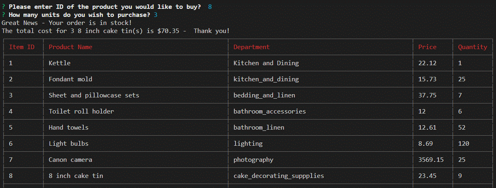

# bamazon

This is an Amazon-like storefront using MySQL, Inquirer and CLI App npm packages.
The app will take orders from customers and deplete stock from the inventory.

There are two views 
## Customer View
The products table the following columns:

1. item_id (unique id for each product)
2. product_name (Name of product)
3. department_name
4. price (cost to customer)
5. stock_quantity (how much of the product is available in stores)

The database is populated with 10 different products.

 

The user is prompted with two messages.
1.  Asking them the ID of the product they would like to buy.
2.  How many units of the product they would like to buy.

## Successful purchase

 

The stock quantity is then adjusted.

## Insufficient quantity

 

## Manager View

Running this application will:
List a set of menu options:
1. View Products for Sale - the app will list every available item

 

2. View Low Inventory - the app will list all items with an inventory count lower than five

 

3. Add to Inventory - the app will display a prompt that will let the manager "add more" of any item currently in the store.
4. Add New Product - the app will allow the manager to add a completely new product to the store.

 

 

5. End Session - the app will allow the manager to end the session.

 

